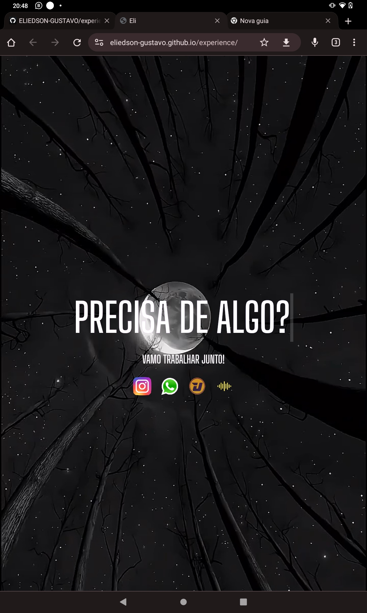
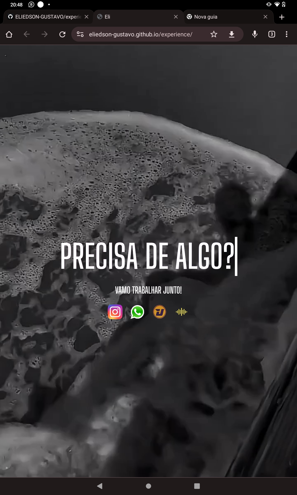
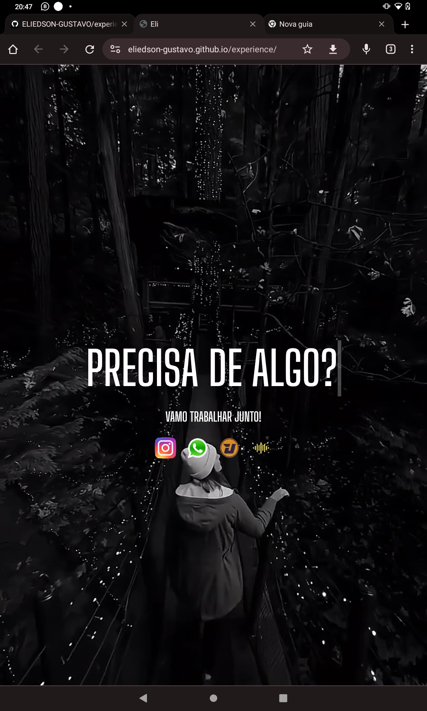

# Instagram_BIO

Página que se pode usar na biografia de redes sociais, para redirecionar ela para outros lugares, como por exemplo, outras redes que ela possa usar de acordo com sua escolha, tendo música e fundo de acordo com gosto pessoal do usuário ADM da página de redirect, com testo interativo na tela,

                                                                                                                        
                                                                                                                                                                                                                                                                
                                                                                                                                                                                                                                                                                                                                                                                                        
                                                                                                                                                                                                                                                                                                                                                                                                                                                                                                                                                                
                                                                                                                                                                                                                                                                                                                                                                                                                                                                                                                                                                                                                                                                                                                                    

                                                
<a href {
                                                                                                  width:40px;                                                                                         height: 40px;
                                                 cursor: pointer;
                                                  gap: 20px;
                                                  aliign-items: center;
                                                  justify-center:center;
                                                  display: flex;

                                                                                                      }
                                                 